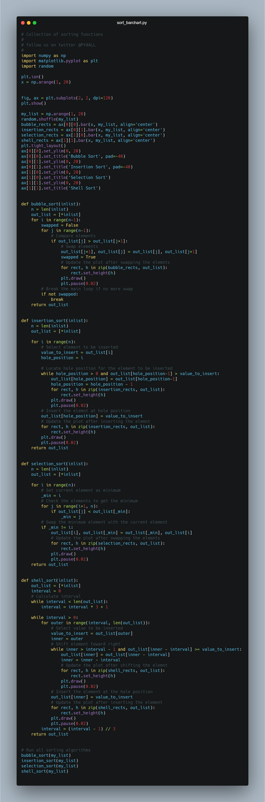
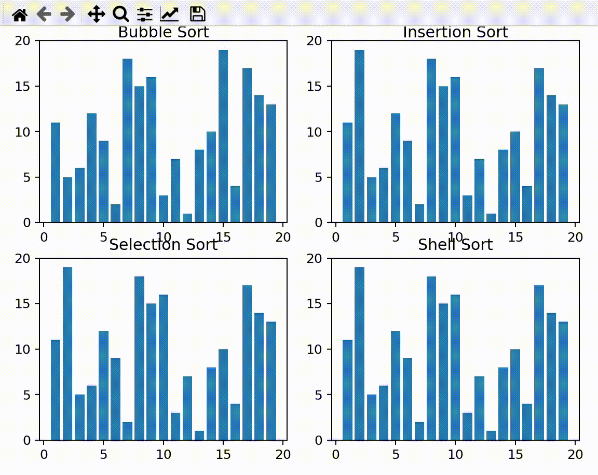

# Sorting_Algorithms
display 4 types of sorting algorithms using python 



## This is a GUI based Python Program which display sorting algorithms progress on barcharts.
<br>

 ## Install
  Executable Application on Windows:
  ```
  - Download this repository on local machine.
  - Extract Sorting_Algorithms repository on local machine and open Sorting_Algorithms folder
  ```

  Python Code On windows machine:

  clone Sorting_Algorithms repository on local machine.
  ```
  >git clone https://github.com/geosaleh/Sorting_Algorithms
  ```
  change directory to Sorting_Algorithms
  ```
  > cd Sorting_Algorithms/
  ```

Now its time to execute **sort_barchart.py**
```
>python sort_barchart.py
```
it will show following Output


## Download
:paperclip: [Download Here](https://github.com/geosaleh/Sorting_Algorithms/archive/refs/heads/master.zip)

Hope you'll install it in your computer just to try .

